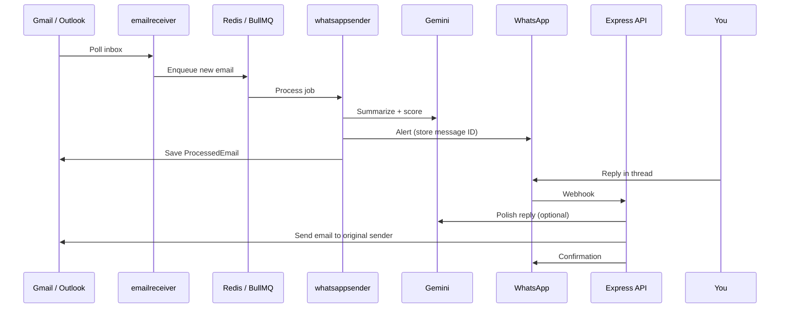

# EmailBot — AI Email Intelligence on WhatsApp

**Your inbox is noisy. EmailBot is your filter.**

EmailBot connects to **Gmail** and **Outlook**, uses **Google Gemini** to score and summarize every message, and pushes only what matters to **WhatsApp**. Reply in-thread on WhatsApp — AI polishes your text and sends it back as a proper email to the original sender.

[](https://www.typescriptlang.org/)
[](https://ai.google.dev/)
[](https://www.postgresql.org/)
[](https://docs.bullmq.io/)

---

## How it works

### 1. Inbound email → WhatsApp alert

1. **emailreceiver** polls connected inboxes (~every 60s).
2. New messages are enqueued on **Redis** (BullMQ).
3. **whatsappsender** consumes jobs, calls Gemini for **summary**, **category**, and **priority (1–10)**.
4. If priority, sender/keyword rules, or AI fallback logic says notify → a WhatsApp message is sent.
5. Metadata is stored in PostgreSQL (`ProcessedEmail`), including **`whatsappMessageId`** for reply threading.

### 2. WhatsApp reply → email (core loop)

1. You **reply in WhatsApp to the notification** (must be a threaded reply, not a new chat).
2. Meta sends a webhook to the **API**.
3. The API matches `message.context.id` to `ProcessedEmail.whatsappMessageId`.
4. Optional: **Gemini** refines your short reply into a professional email body (`aiReplyImprovement`, on by default).
5. The API sends a **Gmail or Outlook reply** to the original sender.
6. You get a WhatsApp confirmation that the reply was sent.

You can also reply from the **dashboard** (`POST /api/emails/:id/reply`) with the same AI polish.



---

## Features

| Feature | Description |
|--------|-------------|
| **Multi-provider inbox** | Gmail + Outlook via OAuth2 (no stored passwords) |
| **AI triage** | Gemini scores (1–10), summarizes, and categorizes mail |
| **WhatsApp alerts** | High-priority / rule-matched mail forwarded to your number |
| **Reply from WhatsApp** | Threaded reply → AI polish → email back to sender |
| **Filter rules** | Sender, keyword, or minimum priority threshold |
| **Daily digest** | Timezone-aware morning recap via WhatsApp |
| **Dashboard** | Next.js app: emails, rules, settings, analytics |

---

## Architecture

```
┌──────────────────────────────────────────────────────────────────┐
│                     Turborepo monorepo                           │
├─────────────┬──────────────┬────────────────┬────────────────────┤
│  apps/api   │  apps/web    │ emailreceiver  │  whatsappsender    │
│  Express    │  Next.js 15  │  poll worker   │  BullMQ consumer   │
│             │              │                │                    │
│ • OAuth     │ • Landing    │ • Gmail/Outlook│ • AI summarize     │
│ • REST API  │ • Dashboard  │ • enqueue jobs │ • WhatsApp notify  │
│ • WA webhook│              │                │ • persist metadata │
├─────────────┴──────────────┴────────────────┴────────────────────┤
│  packages/db (Prisma)  ·  packages/shared (AI, WhatsApp, env)  │
├──────────────────────────────────────────────────────────────────┤
│  PostgreSQL (Docker)  ·  Redis (Docker)  ·  Meta WhatsApp API    │
└──────────────────────────────────────────────────────────────────┘
```

| Service | Role | Default port |
|---------|------|----------------|
| `apps/web` | Landing + dashboard UI | 3000 |
| `apps/api` | OAuth, REST, WhatsApp webhooks | 3001 |
| `apps/emailreceiver` | Inbox polling → queue | — |
| `apps/whatsappsender` | Queue → AI → WhatsApp | — |

**WhatsApp webhook routes (API)**

| Method | Path | Purpose |
|--------|------|---------|
| `GET` | `/whatsapp/webhook` | Meta verification |
| `POST` | `/whatsapp/webhook` | Incoming messages + replies (primary handler) |
| `POST` | `/webhook/whatsapp` | Alternate reply handler |

Point your Meta app webhook to `https://<your-api>/whatsapp/webhook`.

---

## Tech stack

| Layer | Technology |
|-------|------------|
| Monorepo | Turborepo |
| Frontend | Next.js 15, Tailwind CSS v4, Framer Motion |
| Backend | Node.js, Express, TypeScript |
| Database | PostgreSQL, Prisma |
| Queue | BullMQ + Redis |
| AI | Google Gemini (`gemini-2.5-flash-lite` in worker; API uses Gemini for reply polish) |
| WhatsApp | Meta WhatsApp Cloud API v22 |
| Email | Gmail API + Microsoft Graph |

---

## Project structure

```
EmailBot/
├── apps/
│   ├── api/              # Express — OAuth, dashboard API, WhatsApp webhooks
│   ├── web/              # Next.js — landing + dashboard
│   ├── emailreceiver/    # Cron worker — poll inboxes, enqueue jobs
│   └── whatsappsender/   # Worker — AI + WhatsApp notifications
├── packages/
│   ├── db/               # Prisma schema, migrations, seed
│   ├── shared/           # AI summarize, WhatsApp client, logger, env
│   ├── ui/               # Shared UI (monorepo)
│   ├── eslint-config/
│   └── typescript-config/
├── docker-compose.yml    # PostgreSQL + Redis
└── turbo.json
```

---

## Getting started

### Prerequisites

- **Node.js 18+**
- **Docker** (PostgreSQL + Redis)
- **Google Cloud** — Gmail OAuth + Gemini API key
- **Microsoft Azure** — Outlook app registration (optional)
- **Meta Developer** — WhatsApp Cloud API app + webhook URL

### Install

```bash
git clone https://github.com/ali-imtiyazkhan/EmailBot.git
cd EmailBot

npm install

cp .env.example .env
# Edit .env with your credentials (see table below)
```

### Environment variables

| Variable | Description |
|----------|-------------|
| `DATABASE_URL` | PostgreSQL connection string |
| `REDIS_URL` | Redis for BullMQ |
| `API_PORT` | API server port (default `3001`) |
| `FRONTEND_URL` | Web origin for CORS (default `http://localhost:3000`) |
| `BASE_URL` | Public API URL for OAuth redirects |
| `GMAIL_*` / `OUTLOOK_*` | OAuth client credentials |
| `GOOGLE_API_KEY` | Gemini API key |
| `WHATSAPP_*` | Meta Cloud API token, phone number ID, verify token |
| `WHATSAPP_VERIFY_TOKEN` | Must match Meta webhook config |

For the web app, set `NEXT_PUBLIC_API_URL=http://localhost:3001` in `apps/web/.env.local` (or root `.env` if your setup loads it).

### Database

```bash
docker compose up -d

npm run generate -w @repo/db

cd packages/db && npx prisma db push && npx prisma db seed
```

Seed creates a demo user (`admin@emailbot.io`) — update `whatsapp` in the DB to your real E.164 number for testing.

### Run locally

```bash
# All services (Turborepo)
npm run dev

# Or individually:
npm run dev -w api
npm run dev -w web
npm run dev -w emailreceiver
npm run dev -w whatsappsender
```

| App | URL |
|-----|-----|
| Dashboard & landing | http://localhost:3000 |
| API + health | http://localhost:3001/health |

### Connect accounts

1. Open **Settings** in the dashboard (or hit OAuth URLs on the API).
2. Connect **Gmail** and/or **Outlook**.
3. Ensure your user row has the correct **WhatsApp** number (E.164, no spaces).
4. Configure Meta webhook → `BASE_URL/whatsapp/webhook`.

---

## Security

- OAuth2 for mail providers — refresh tokens stored in DB, not user passwords
- Helmet, CORS, rate limiting on API routes
- Zod validation on dashboard endpoints
- WhatsApp replies only honored when tied to a stored `whatsappMessageId` (threaded reply)

---

## Roadmap / known gaps

- Session-based multi-user auth (OAuth callbacks currently use a fixed demo `userId` in places)
- Automated test suite
- Production hardening: idempotency, dead-letter queue, observability

Contributions welcome.

---

## License

MIT
